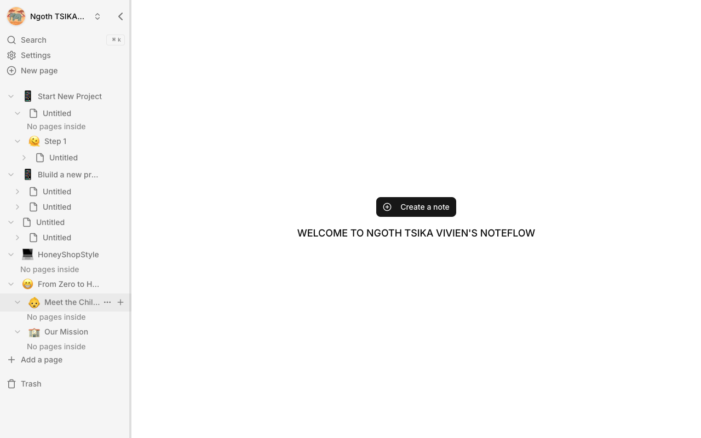
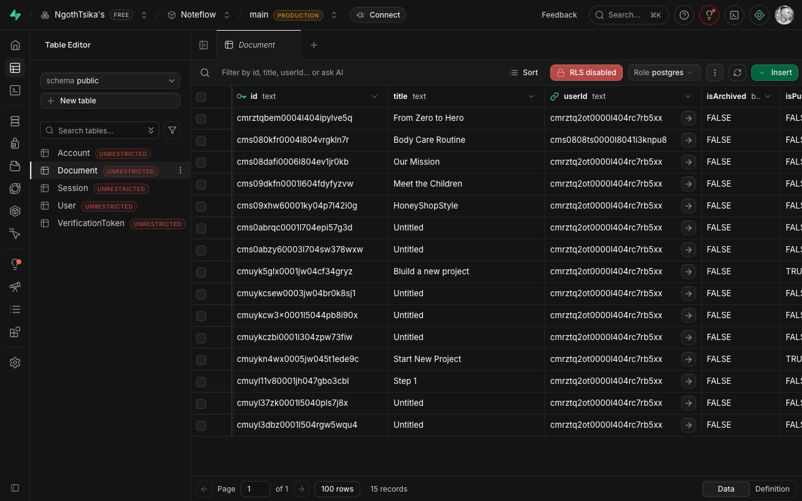
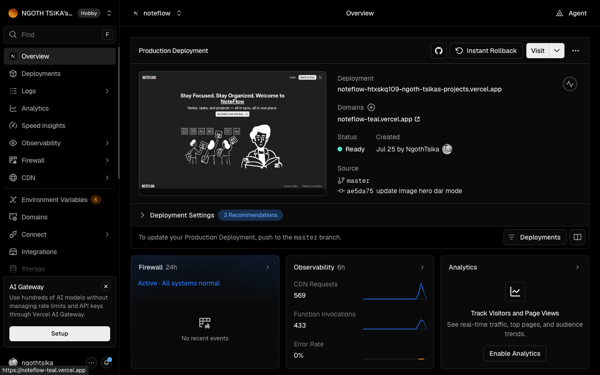

# NOTFLOW

A modern note-taking and workspace app inspired by Notion-style productivity tools. The project combines a fast Next.js frontend with a rich editor experience and a robust backend for authentication, storage, and collaboration.

## Most important dependency

The most important library in this project is [@blocknote/react](https://www.npmjs.com/package/@blocknote/react), which powers the page editing experience. It provides the block-based editor used to create notes, structure content, and build a Notion-like workflow.

### Core stack

- [Next.js](https://nextjs.org/) – application framework and app routing
- [@blocknote/react](https://www.npmjs.com/package/@blocknote/react) – rich block editor
- [@blocknote/core](https://www.npmjs.com/package/@blocknote/core) – editor core logic and schema
- [NextAuth](https://next-auth.js.org/) – authentication
- [Prisma](https://www.prisma.io/) – database ORM and schema management
- [Supabase](https://supabase.com/) – database/storage integration
- [Tailwind CSS](https://tailwindcss.com/) – styling system
- [Lucide React](https://lucide.dev/) – app icons

## Project UI



### Key screens






## Getting started

Install dependencies:

```bash
npm install
```

Run the development server:

```bash
npm run dev
```

Then open [http://localhost:3000](http://localhost:3000) in your browser.

## Development notes

This app is designed for a note-first workflow with a productivity dashboard, content publishing, search, and authentication flows. It is built to feel familiar to users of Notion and similar knowledge/workspace tools while still keeping the stack fast and developer-friendly.
